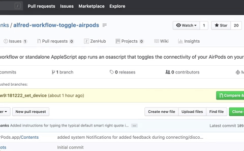
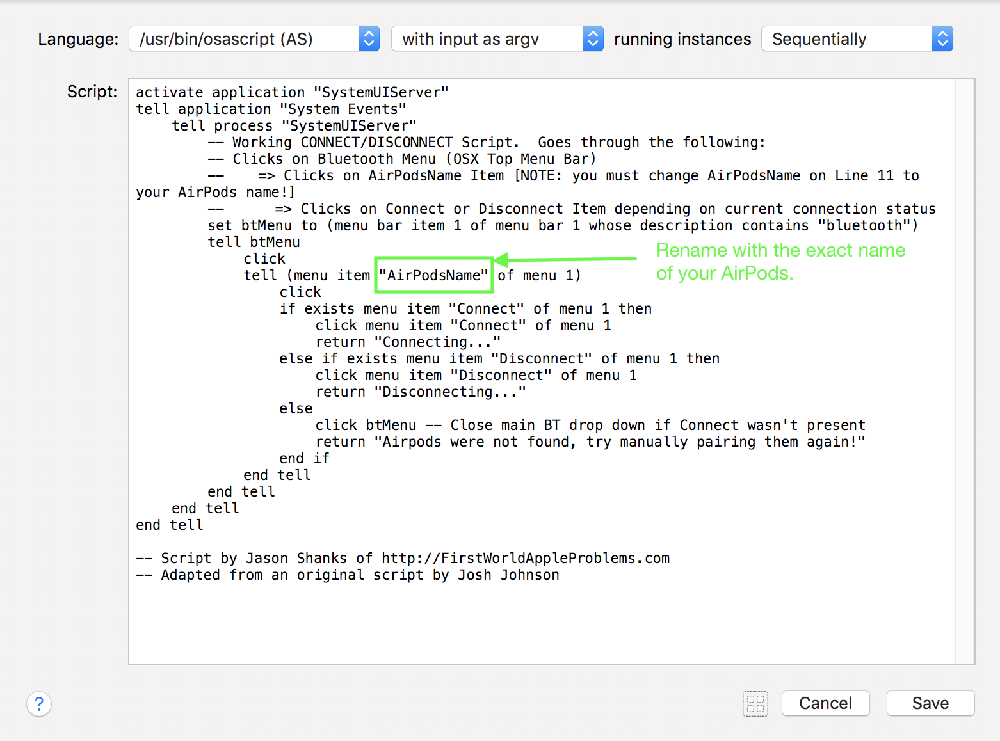

Alfred Workflow – Toggle AirPods
=====================

Have you ever tried to ask Siri to connect to your AirPods? Alas, it can't. So until that day arrives, here's a script solution for you!

This Alfred workflow runs an osascript that toggles the connectivity of your AirPods on your Mac. It offers a keyword or Hotkey trigger to initiate it, which you can customise however you want.

The original script credit goes to Josh Johnson for his AppleScript that either connects or errors out responsibly. His excellent instructions and suggestions for other methods of triggering it can be found over on [Medium](https://medium.com/@secondfret/how-to-connect-your-airpods-to-your-mac-with-a-keyboard-shortcut-9d72e786993b).

## Extended features
The original functionality has been extended with:

* a check for the current Connect/Disconnect status, which then toggles the connectivity based on this state.
* System notifications which provide further confirmation of connection status.
* The applescript was fully incorporated into an osascript embedded within an Alfred Workflow (instead of launching it externally) and later to a python script.

If you're not an Alfred user you can still launch the Applescript app through many other methods such as adding it to your Dock, using [Apple's Spotlight](https://support.apple.com/en-us/HT204014)  or support some other great indie developers with: [QuickSilver](https://qsapp.com), [BetterTouchTool](https://www.boastr.net), [LaunchBar](https://www.obdev.at/products/launchbar/index.html),  [Keyboard Maestro](https://www.keyboardmaestro.com/main/).  Just [download](https://github.com/jasonshanks/alfred-workflow-toggle-airpods/archive/master.zip) this entire Github package and unzip.

## Requirements
1. [Alfred App v3+](http://www.alfredapp.com/#download) – install the latest free version of Alfred.
2. [Alfred Powerpack](https://www.alfredapp.com/powerpack/buy/) – buy the Powerpack (required to use workflows such as this and unlock all the other awesome potential in Alfred)
3. [Toggle Airpods workflow](https://raw.github.com/jasonshanks/alfred-workflow-toggle-airpods/master/toggle-airpods.alfredworkflow) – direct download of this script.

## Installation: Alfred
Assuming you meet the requirements above:
1. Double-click the workflow you downloaded above to install in Alfred.
2. Review the workflow's Keyword and  Hotkey and customise to your liking. I use a Hyper Key trigger [1](#fn1)	
3. run **setairpods** and select your device

## Commands
- setting
  - Keyword: `setairpods`

- run
  - Keyword: `airpods`
  - Hotkey: `CONTROL+OPTION+COMMAND+SHIFT+P` or `CAPS LOCK+P` (if you have  a Hyper Key).

## Installation: other launchers or directly as an Applescript

1. Customise the name of your device in the script as indicated below. 
2. Move to your ~/Library/Scripts folder or wherever your launcher of choice looks for scripts. It's also possible to open the ToggleAirPods.app with Apple Script Editor and copy and paste the code directly in to the appropriate place of your launcher's command.

## Contributors
- [@jasonshanks](https://github.com/jasonshanks)
- [novelview9](https://github.com/novelview9)
- [@secondfret](https://github.com/secondfret)

<a name="fn1">1</a>: All you need to do is install  [Karabiner](https://pqrs.org/osx/karabiner/index.html), a free keyboard customiser then enable the Complex Modification example called: `Change caps_lock to command+control+option+shift`. Inspired by [Brett Terpstra's Hyper Key idea](http://brettterpstra.com/2012/12/08/a-useful-caps-lock-key/).

## Release notes
* 2019-09-13
	- Removed now unnecessary script line that stole focus away from the previous window. [Thanks to Raphus-cucullatus!]
	- Relocated animated gif instruction with repo.
	- Recompiled the original applescript for 64bit in case other than Alfred users still want to delve in to adapting it.
* 2018-12-28 Script restructuring, replaced manual device naming in script with dedicated *setairpods* command. Korean localisation. Anymore localisations most welcome! [novelview9]
* 2018-01-05 Initial release

## Todo
* rename more generically as it really works for any bluetooth audio device now.
* Add support for ASCII characters outside of core 128 character range. I like to use an Emoji character on all my devices these days to visually set them apart from other people's in the vicinity. &#x1F917;
* More localisations
* More informative notification besides just complete. i.e. differentiate between Connected/Disconnected.
